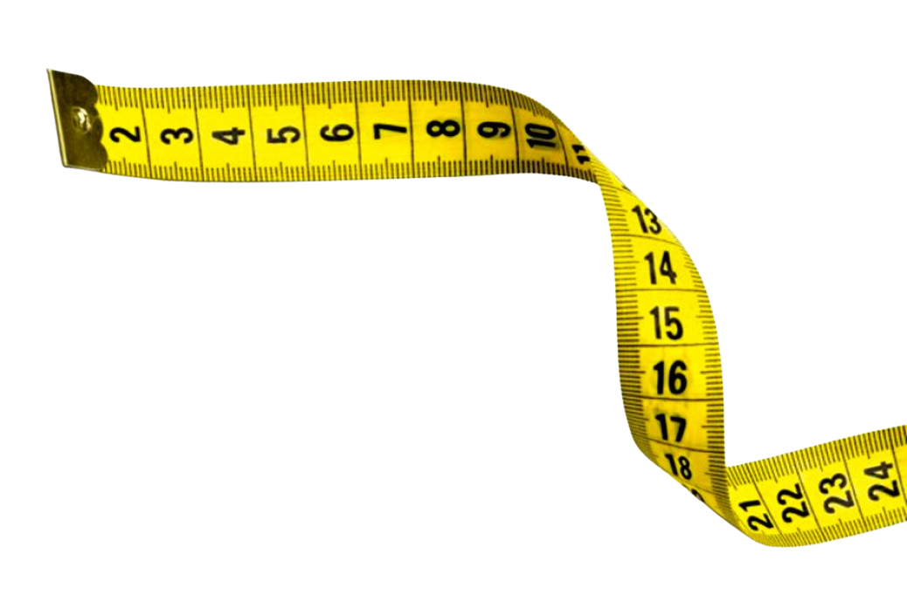

# Zutterman Landing Page 

</br>

<p align="center">
  
</p>

</br>

## About ❔

Challenge 2 was to implement the zutterman landing page following the following layout provided https://www.figma.com/file/GTEyrXtVtgSDeiocLk7KzCFf/layout-teste-avaliacao

<!-- ## Preview

um gif da aplicação bem maneiro -->

</br>

## Deployment 🚀

<p align="center"><a  href="https://calindra-desafio-2.vercel.app/">https://calindra-desafio-2.vercel.app/</a></p>

</br>

## Features ✅

- [x] Layout implemented

</br>

## How to run 🏃‍♀️💨

```bash
# Clone this repository in another folder
$ git clone https://github.com/victordurco/calindra-desafio-2

# Access the project folder cmd/terminal
$ cd calindra-desafio-2

# Install the dependencies
$ npm i

# Compile the code
$ npm run build

# Run the application
$ npm start

# The server will automatically start at localhost:3000/ on your favorite browser
```

</br>

## Tech Stack 💾

<br/>

<p align="center">


</p>

</br>

<!--
### Contributors and Contact

### Acknowledgements -->
